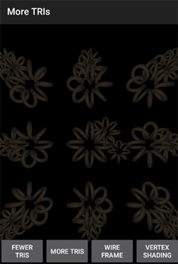
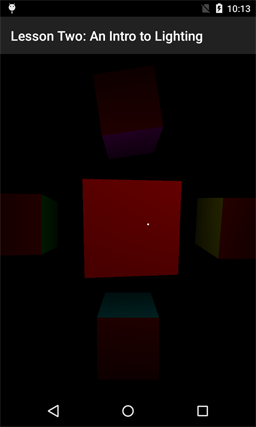
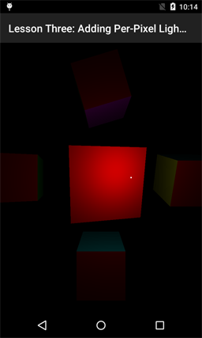
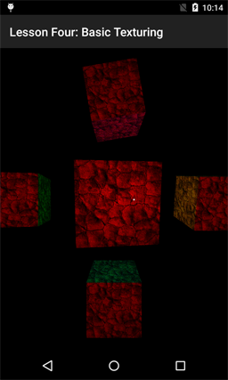
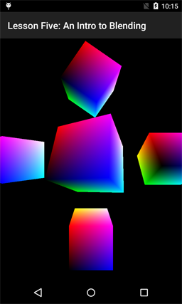
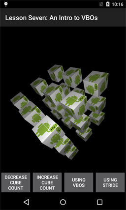
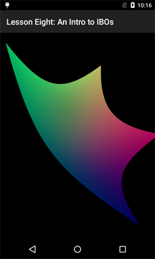

# OpenGLES-Sandbox

Extension / experiments derived from:

https://github.com/jimandreas/AndroidOpenGLESLessons

which in turn were a port from:

Original Github location:  https://github.com/learnopengles/Learn-OpenGLES-Tutorials

## What has changed:

I have added three studies to the start of the over all lesson layout:

1) A GL Object study - various geometric shapes are studied.

2) A small study on loading the OBJ file format was implemented.

3) The ToroidHelix object can be duplicated in a scene to study the performance of Android graphics.

Have fun looking at these if you like.

:sweat_smile:  - jim a

### Current Studio level (13 Feb 2016):

Android Studio 2.0 Beta 2   Build date: 1 Dec 2015

compileSdkVersion 23

buildToolsVersion "23.0.2"

## License

Copyright 2011-2012 Learn OpenGL ES

   Licensed under the Apache License, Version 2.0 (the "License");
   you may not use this file except in compliance with the License.
   You may obtain a copy of the License at

       http://www.apache.org/licenses/LICENSE-2.0

   Unless required by applicable law or agreed to in writing, software
   distributed under the License is distributed on an "AS IS" BASIS,
   WITHOUT WARRANTIES OR CONDITIONS OF ANY KIND, either express or implied.
   See the License for the specific language governing permissions and
   limitations under the License.

## DISCLAIMER

**THE SOFTWARE IS PROVIDED "AS IS", WITHOUT WARRANTY OF ANY KIND, EXPRESS OR
IMPLIED, INCLUDING BUT NOT LIMITED TO THE WARRANTIES OF MERCHANTABILITY,
FITNESS FOR A PARTICULAR PURPOSE AND NONINFRINGEMENT. IN NO EVENT SHALL THE
AUTHORS OR COPYRIGHT HOLDERS BE LIABLE FOR ANY CLAIM, DAMAGES OR OTHER
LIABILITY, WHETHER IN AN ACTION OF CONTRACT, TORT OR OTHERWISE, ARISING FROM,
OUT OF OR IN CONNECTION WITH THE SOFTWARE OR THE USE OR OTHER DEALINGS IN
THE SOFTWARE.**

## Supported Platforms 

As part of this port to Android Studio - the sample code for platforms other than Android has been 
stripped out.

For more information on these samples please refer to the links above.

## Table Of Contents

## Display Objects

## Load OBJ file

## More Triangles

## Lesson 1

## Lesson 2

## Lesson 3

## Lesson 4

## Lesson 5

## Lesson 6

## Lesson 7

## Lesson 8

