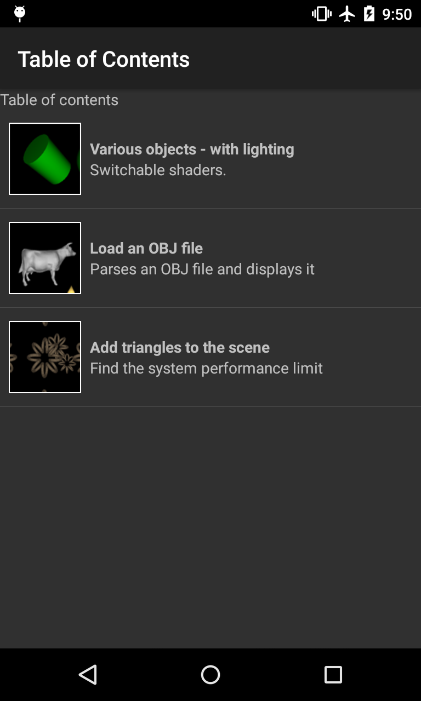
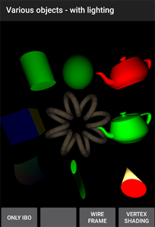
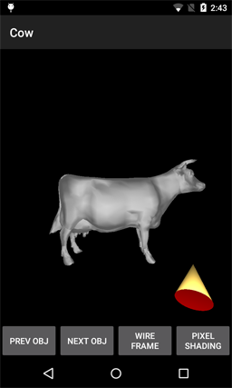

Android OpenGL test repo
------------------------

<b>Description</b>

1) A GL Object study - various geometric shapes are studied.

2) A small study on loading the OBJ file format was implemented.

3) The ToroidHelix object can be duplicated in a scene to study the performance of Android graphics.

Have fun looking at these if you like.

:sweat_smile:  - jim a

### Current Studio level (Nov 2016)

Android Studio 2.2.2

### License

See LICENSE.TXT

## Table Of Contents

## Display Objects

## Load OBJ file

## More Triangles

# Acknowledgements

This Android OpenGL study used this Repo as a base for initial coding:

https://github.com/learnopengles/Learn-OpenGLES-Tutorials

