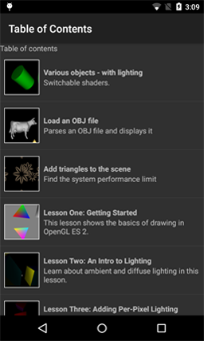

# Learn-OpenGLES-Tutorials / android / AndroidOpenGLESLessons/

*Port of AndroidOpenGLESLessons folder to Android Studio*

Original Github location:  https://github.com/learnopengles/Learn-OpenGLES-Tutorials

This project is a repository for the lessons and tutorials over at http://www.learnopengles.com/

The compiled app can be downloaded from the Android market at https://market.android.com/details?id=com.learnopengles.android

*No WebGL work is present in this port of the Android folder*

## What has changed:

The samples have been reworked so that they all live happily (more or less) in one Android Studio project.
In theory you should be able to pull the repo or download the zip file, and then hand the (uncompressed) folder 
to Android Studio and everything should just build.

The copy of the Gihub repo imported into Android Studio just fine.  I added my favorite .gitnore files and then compiled it.
It was a completely clean build without changing a single line of code at the initial Git checkin tag.
Since the initial build - I have taken screenshots and built a README.md file.    Now the reading and understanding
and practice begins :sweat_smile:  - jim a

### Current Studio level (27 Jan 2016):

Android Studio 1.5.1   Build date: 1 Dec 2015

compileSdkVersion 23

buildToolsVersion "23.0.2"

## License

Copyright 2011-2012 Learn OpenGL ES

   Licensed under the Apache License, Version 2.0 (the "License");
   you may not use this file except in compliance with the License.
   You may obtain a copy of the License at

       http://www.apache.org/licenses/LICENSE-2.0

   Unless required by applicable law or agreed to in writing, software
   distributed under the License is distributed on an "AS IS" BASIS,
   WITHOUT WARRANTIES OR CONDITIONS OF ANY KIND, either express or implied.
   See the License for the specific language governing permissions and
   limitations under the License.

## DISCLAIMER

**THE SOFTWARE IS PROVIDED "AS IS", WITHOUT WARRANTY OF ANY KIND, EXPRESS OR
IMPLIED, INCLUDING BUT NOT LIMITED TO THE WARRANTIES OF MERCHANTABILITY,
FITNESS FOR A PARTICULAR PURPOSE AND NONINFRINGEMENT. IN NO EVENT SHALL THE
AUTHORS OR COPYRIGHT HOLDERS BE LIABLE FOR ANY CLAIM, DAMAGES OR OTHER
LIABILITY, WHETHER IN AN ACTION OF CONTRACT, TORT OR OTHERWISE, ARISING FROM,
OUT OF OR IN CONNECTION WITH THE SOFTWARE OR THE USE OR OTHER DEALINGS IN
THE SOFTWARE.**

## Supported Platforms 

As part of this port to Android Studio - the sample code for platforms other than Android has been 
stripped out.

For more information on these samples please refer to the links above.

## app Table Of Contents

## Lesson 1

## Lesson 2

## Lesson 3

## Lesson 4

## Lesson 5

## Lesson 6

## Lesson 7

## Lesson 8

